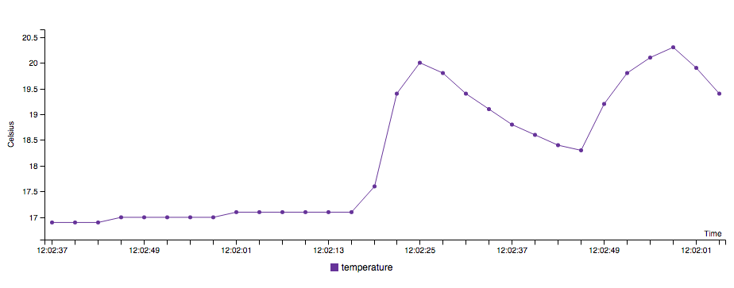

# EON Demo from sensor data using Arduino and Johnny-Five on Node.js with Express and Jade

## Quick Start
You need to install *Johnny-Five*, *PubNub*, *Jade* and *Express* to run the node.js code with Arduino.

Install all the dependencies: 

```bash
$ npm install
```

Start the server:
```bash
$ npm start
```
Then go to `http://localhost:3000` on browser

## Example


## Docs and Websites
* [Website of Johnny-Five](http://johnny-five.io/) - [Docs](https://github.com/rwaldron/johnny-five/wiki)
* [Website of Express](http://expressjs.com/) - [Docs - v4.x](http://expressjs.com/en/4x/api.html)
* [Website of PubNub](https://www.pubnub.com/) - [Docs](https://www.pubnub.com/documentation/)
* [Website of Jade](http://jade-lang.com/) - [Docs](http://jade-lang.com/reference/)

## Credits
An original project of [Tomomi ❤ Imura](https://github.com/girliemac)